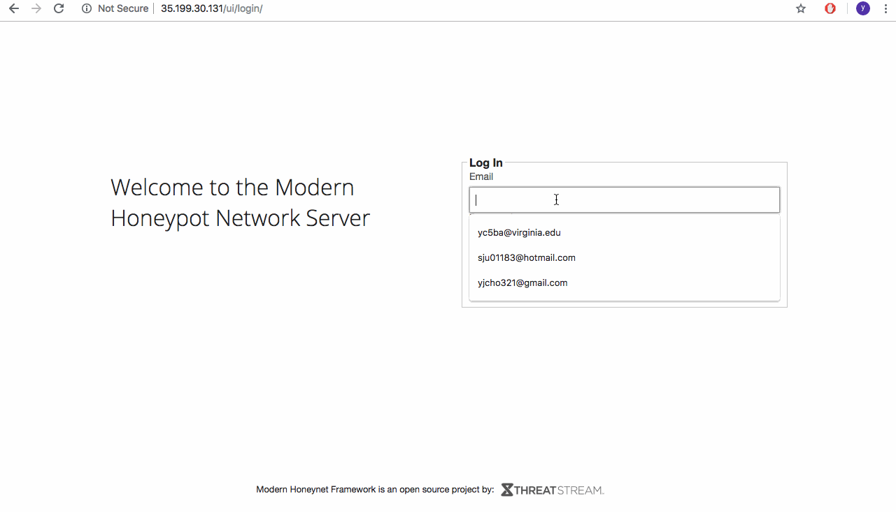

# Project 9 - Honeypot

Time spent: **9** hours spent in total

## Honeypot(s) Deployed
  - 1 Honeypot deployed
  - Ubuntu - Dionaea with HTTP
  
## Issues Encountered

### MHN Admin Application Installation Error
  - The following command fails:
  ```
  sudo git clone https://github.com/RedolentSun/mhn.git
  cd mhn
  sudo ./install.sh
  ``` 
  - It failed as the installation contained a ```git clone``` command from a non-existing repo
  - Fixed by cloning from the following repo ```https://github.com/RedolentSun/mhn.git```
  
### MHN Admin Application Access Error
  - The MHN Admin Application was not accessible via brower; only the Honeymap was accessible through port 3000
  - Google Cloud platform firewall was blocking port 80 by default
  - Fixed by changing the firewall rule creation code to include port 80: ```gcloud beta compute firewall-rules create mhn-allow-admin --direction=INGRESS --priority=1000 --network=default --action=ALLOW --rules=tcp:3000,tcp:10000,tcp:80 --source-ranges=0.0.0.0/0 --target-tags=mhn-admin```
  
## Data Collection
  - 7,147 attacks in approximately 12 hours
  - 4,994 attacks were from ```nmap``` commands from my machine
  - 2,153 non-local attacks in approximately 12 hours
  - 0 malware samples collected
  - result attached as [session.json](session.json)
  
